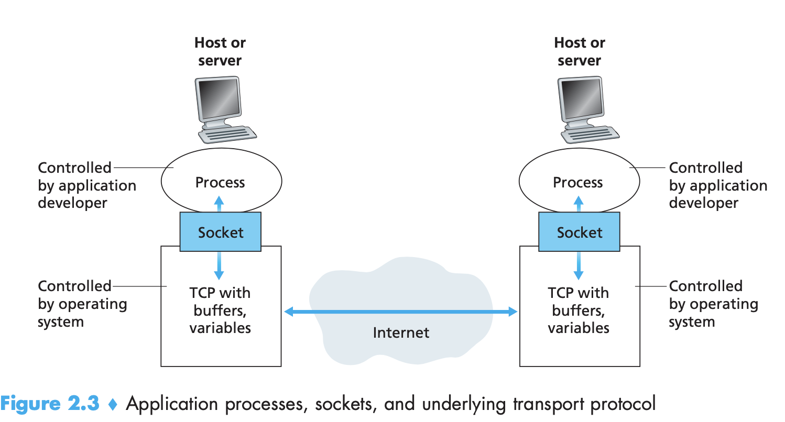
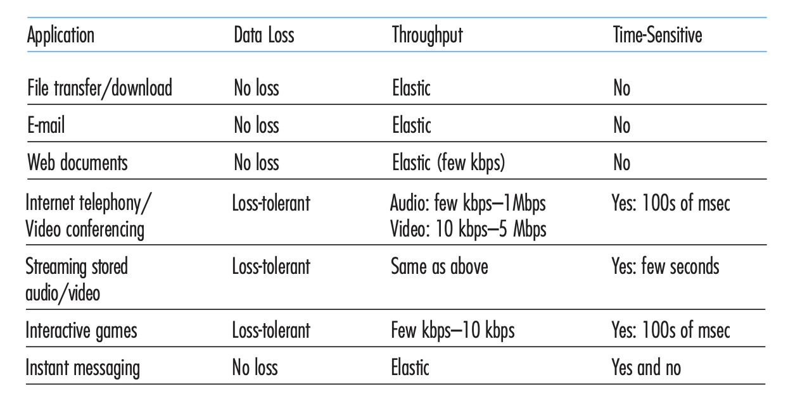
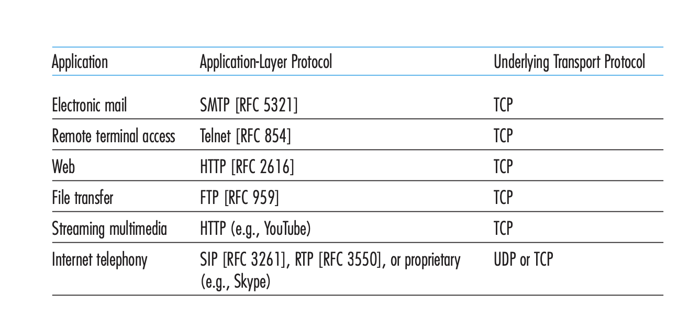
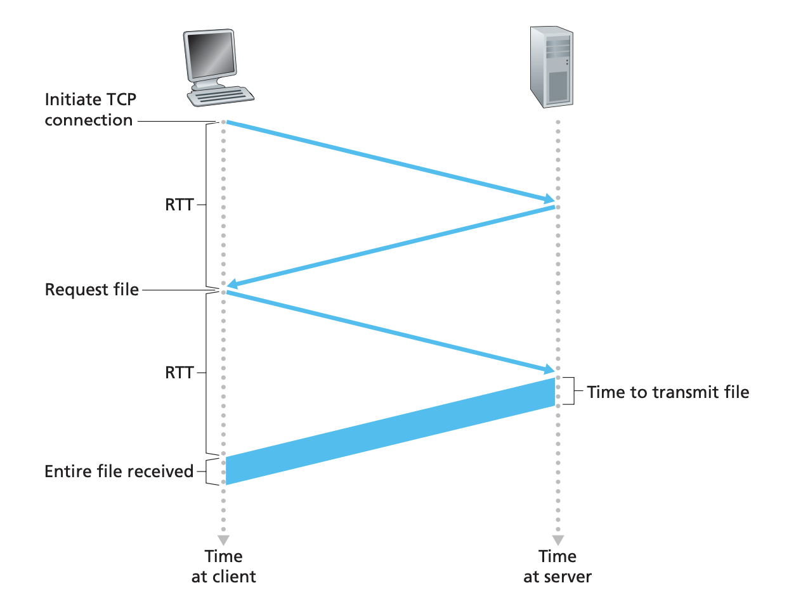
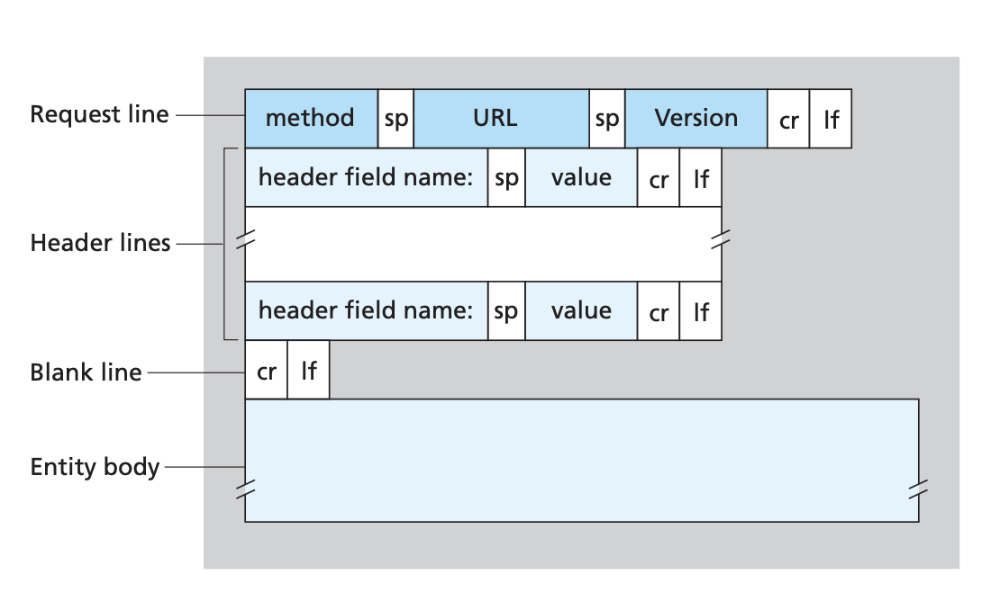
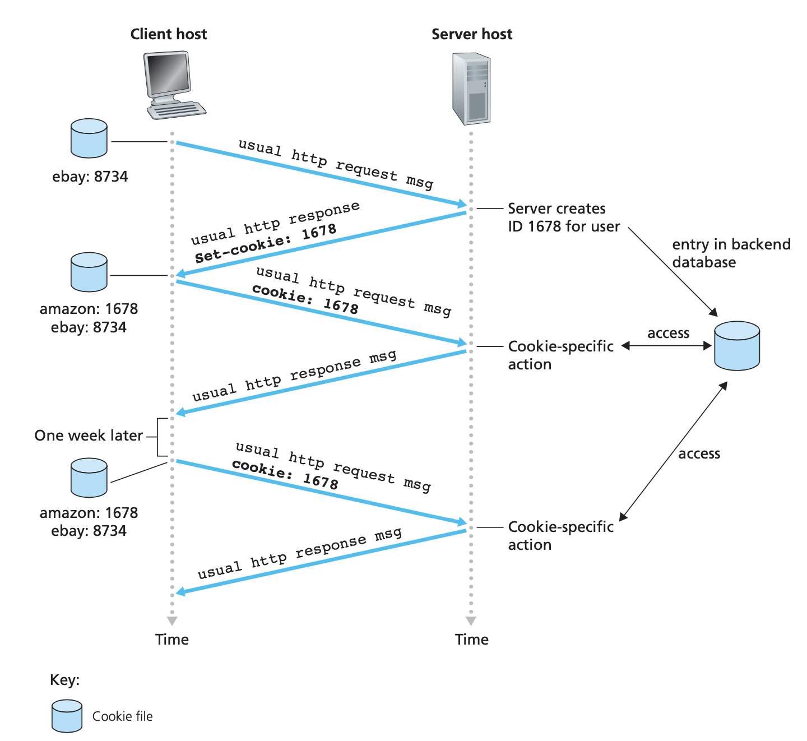

# Chapter 2 Application Layer

Main driving force to dev Inet - creation of applications:

- text email, remote access to computers, file transfers, and newsgroups
- World Wide Web:
    - Web surfing
    - search
    - electronic commerce

-  instant messaging and P2P file sharing
-  voice and video applications:

    - voice-over-IP (VoIP) and video conferencing over IP such as Skype
    - user-generated video distribution (YouTube)
    - movies on demand (Netflix) 

- multi-player online games
- social networking applications (Facebook, Twitter)

## :green_circle: 2.1 Principles of Network Applications 

Network application dev - write programs that:
1. run on different end systems 
2. communicate with each other over the network

For example, Web apps:
1. the browser program running in the user’s host (desktop, laptop, tablet, smartphone, and so on)
2. the Web server program running in the Web server host

You do not need to (and actually can not) write software that runs on network core devices, such as routers or link-layer switches - they do not function at the application layer but instead function at lower layers.

### :small_blue_diamond: 2.1.1. Network Apps Architectures 

Two predominant architectural paradigms used in modern network applications: 
- the client-server architecture 
- the peer-to-peer (P2P) architecture

**Client-server architecture**

There is an always-on host, called the **server**, which services requests from many other hosts, called **clients**. 

Web application: always-on Web server services requests from browsers running on client hosts. When a Web server receives a request for an object from a client host, it responds by sending the requested object to the client host. 

Clients do not directly communicate with each other (in the Web application, two browsers do not directly communicate). 

Another characteristic of the client-server architecture is that the server has a fixed, well-known IP address.

Apps with a client-server architecture: Web, FTP, Telnet, and e-mail. 

To keep up with requests from clients - virtual server in data center. Google has 30 to 50 data centers distributed around the world, which collectively handle search, YouTube, Gmail, and other services. A data center can have 100s of 1000s of servers, which must be powered and maintained. Additionally, the service providers must pay recurring interconnection and bandwidth costs for sending data from their data centers.

**P2P architecture**

No dedicated servers. Instead -  direct communication between pairs of intermittently connected hosts, **peers**. E.g. file sharing (BitTorrent), peer-assisted download acceleration (Xunlei), Internet Telephony (Skype), and IPTV (Kankan and PPstream).

Some apps have hybrid architectures, combining both client-server and P2P elements. For example, for many instant messaging applications, servers are used to track the IP addresses of users, but user-to-user messages are sent directly between user hosts (without passing through intermediate servers).

P2P architectures pros:
- self-scalability
- cost effective

P2P architectures cons:
- most residential ISPs have been dimensioned for “asymmetrical” bandwidth usage, that is, for much more downstream than upstream traffic. P2P video streaming and file distribution apps shift upstream traffic from servers to residential ISPs,thereby putting significant stress on the ISPs.
- challenge to secure
- The success of P2P applications depends on convincing users to volunteer bandwidth, storage, and computation resources to the apps, which is the challenge of incentive design 

### :small_blue_diamond: 2.1.2 Processes Communicating

**A process** - a program that is running within an end system. When processes are running on the same end system, they can communicate with each other with interprocess communication, using rules that are governed by the end system’s operating system.

Processes on two different end systems communicate with each other by exchanging **messages** across the computer network. A sending process creates and sends messages into the network; a receiving process receives these messages and possibly responds by sending messages back.

 **Client and Server Processes**

Label one of the two processes as the client and the other process as the server (“client side and server side of an application”). Web: a browser is a client process and a Web server is a server process. P2P file sharing: the peer that is downloading the file is labeled as the client, and the peer that is uploading the file is labeled as the server.

In the context of a communication session between a pair of processes, the process that initiates the communication (that is, initially contacts the other process at the beginning of the session) is labeled as the client. The process that waits to be contacted to begin the session is the server.

**The Interface Between the Process and the Computer Network**

A process sends messages into, and receives messages from, the network through a software interface called a **socket**.

A **socket** is the interface between the application layer and the transport layer within a host. It is also referred to as the **Application Programming Interface (API)** between the application and the network, since the socket is the programming interface with which network applications are built.

The application developer has control of everything on the app-layer side of the socket but has little control of the transport-layer side of the socket. The only control that the application developer has on the transport-layer side is:
1. choice of transport protocol  
2. fix a few transport-layer parameters such as max buffer and max segment sizes 

**Addressing Processes**

In order for a process running on one host to send packets to a process running on another host, the receiving process needs to have an address.

To identify the receiving process, two pieces of information need to be specified: (1) the address of the host -  IP address
(2) an identifier that specifies the receiving process  (more specifically, the receiving socket) in the destination host - destination **port number** serves this purpose.

Web server is identified by port number 80; A mail server process (using the SMTP protocol) is identified by port number 25. 

### :small_blue_diamond: 2.1.3 Transport Services Available to Applications

Need to choose transport-layer protocol based on provided services:
- reliable data transfer
- throughput
- timing
- security

**Reliable Data Transfer**

If a protocol provides a guaranteed data delivery service - Reliable Data Transfer.
Transport-layer protocol can potentially provide process-to-process reliable data transfer.

Without reliable data transfer - some of the data sent by the sending process may never arrive at the receiving process. This may be acceptable for **loss-tolerant applications** (multimedia apps such as conversational audio/video that can tolerate some amount of data loss. Lost data might result in a small glitch in the audio/video—not a crucial impairment).

**Throughput**

Available throughput - the rate at which the sending process can deliver bits to the receiving process. Can fluctuate as other sessions is sharing bandwidth along the network path.

Transport layer can potentially provide guaranteed available throughput (bits/sec). Important for **bandwidth-sensitive apps** (multimedia apps).

**Elastic applications** can make use of as much, or as little, throughput as happens to be available. Electronic mail, file transfer, and Web transfers are all elastic applications.

**Timing**

Timing guarantees can be in diff form, e.g. every bit that the sender pumps into the socket arrives at the receiver’s socket no more than 100 msec later. \
Important for interactive real-time applications - Internet telephony, virtual environments, teleconferencing, and multiplayer games.

**Security**

Examples:

- confidentiality: in the sending host, a transport protocol can encrypt all data transmitted by the sending process, and in the receiving host, the transport-layer protocol can decrypt the data before delivering the data to the receiving process. Such a service would provide confidentiality between the two processes, even if the data is somehow observed between sending and receiving processes. 
- data integrity 
- end-point authentication

### :small_blue_diamond: 2.1.4 Transport Services Provided by the Internet

The Internet (and, more generally, TCP/IP networks) makes two transport protocols available to applications, UDP and TCP.

The service requirements for some selected applications:

**TCP Services**

The TCP service model includes a connection-oriented service and a reliable data transfer service. When an application invokes TCP as its transport protocol, the application receives both of these services from TCP.

- **Connection-oriented service**  
    **Handshaking procedure**:
    - TCP has the client and server exchange transport layer control information with each other before the app-level messages begin to flow.
    - Alerts the client and server, allowing them to prepare for an onslaught of packets. After the handshaking phase, a TCP connection is said to exist between the sockets of the two processes.
    - The connection is a full-duplex connection in that the two processes can send messages to each other over the connection at the same time. 
    - When the application finishes sending messages, it must tear down the connection. 

- **Reliable data transfer service.** All data sent without error and in the proper order. When one side of the application passes a stream of bytes into a socket, it can count on TCP to deliver the same stream of bytes to the receiving socket, with no missing or duplicate bytes.

- **Congestion-control mechanism**

**UDP Services**

Lightweight transport protocol, providing minimal services; no handshaking; unreliable data transfer; no congestion-control mechanism;  

**Services Not Provided by Internet Transport Protocols**

- reliable data transfer - Yes (TCP)
- throughput - No guarantees
- timing - No guarantees
- security - Yes (TCP)

Time-sensitive apps in Inet often work fairly well because they have been designed to cope, to the greatest extent possible, with this lack of guarantee --> Internet can often provide satisfactory service to time-sensitive applications, but no timing or throughput guarantees.

Many firewalls are configured to block (most types of) UDP traffic.

### :small_blue_diamond: 2.1.5 Application-Layer Protocols

An application-layer protocol defines how an application’s processes, running on diff end systems, pass messages to each other:
- The types of messages exchanged, for example, request messages and response messages
- The syntax of the various message types, such as the fields in the message and how the fields are delineated
- The semantics of the fields - the meaning of the information in the fields
- Rules for determining when and how a process sends messages and responds to
messages

App-layer protocols:

- public (HTTP)
- proprietary (Skype)

Network applications vs application-layer protocols:

Web app:
-  standard for document formats, eg **HTTP (the HyperText Transfer Protocol)**
-  Web browsers (Firefox and Microsoft Internet Explorer)
-  Web servers (Apache and Microsoft servers)
-  app-layer protocol , HTTP, defines the format and sequence of messages exchanged between browser and Web server

Internet e-mail app:
-  mail servers that house user mailboxes
-  mail clients (such as Microsoft Outlook) that allow users to read and create messages
-  a standard for defining the structure of an e-mail message
-  and app-layer protocols that define how messages are passed between servers, how messages are passed between servers and mail clients, and how the contents of message headers are to be interpreted. e.g. **SMTP (Simple Mail Transfer Protocol)**

## 2.2 :green_circle: The Web and HTTP

Until the early 1990s the Internet was used by researchers, academics, and university students to log in to remote hosts, to transfer files from local hosts to remote hosts and vice versa, to receive and send news, and to receive and send electronic mail.\
2003 - YouTube, Gmail, and Facebook.

### :small_blue_diamond: 2.2.1 Overview of HTTP

HTTP is implemented in two programs: (1) a client program and (2) a server program. They talk to each other by exchanging HTTP messages. HTTP defines the structure of these messages and how the client and server exchange the messages.

A Web page ( document) consists of objects. An object is simply a file (HTML file, a JPEG image, a Java applet, a video clip)—that is addressable by a single URL. Most Web pages consist of a base HTML file and several referenced objects. For example, if a Web page contains HTML text and five JPEG images, then the Web page has six objects: the base HTML file plus the five images. The base HTML file references the other objects in the page with the objects’ URLs. Each URL has two components: the hostname of the server that houses the object and the object’s path name. For example, the URL
http://www.someSchool.edu/someDepartment/picture.gif
has www.someSchool.edu for a hostname and /someDepartment/ picture.gif for a path name. 
Web browsers (Internet Explorer,Firefox) - implement the client side of HTTP --> we will use the words browser and client interchangeably. 
Web servers - implement the server side of HTTP, house Web objects, each addressable by a URL. Popular Web servers include Apache and Microsoft Internet Information Server.

HTTP server maintains no info about the clients - **stateless protocol**. 

### :small_blue_diamond: 2.2.2 Non-Persistent and Persistent Connections

**Non-persistent connections** - each request/response pair be sent over a separate TCP connection.
**Persistent connections** - all of the requests and their corresponding responses be sent over the same TCP connection.

HTTP uses persistent connections in its default mode, but HTTP clients and servers can be configured to use non-persistent connections instead.

**HTTP with Non-Persistent Connections**

Example: suppose the page consists of a base HTML file and 10 JPEG images, and that all 11 of these objects reside on the same server. URL for the base HTML file is
http://www.someSchool.edu/someDepartment/home.index

Here is what happens:
1. The HTTP client process initiates a TCP connection to the server www.someSchool.edu on port number 80 (default port number for HTTP). Associated with the TCP connection, there will be a socket at the client and a socket at the server.
2. The HTTP client sends an HTTP request message to the server via its socket.The request message includes the path name /someDepartment/home.index.
3. The HTTP server process receives the request message via its socket, retrieves the object /someDepartment/home.index from its storage (RAM or disk), encapsulates the object in an HTTP response message, and sends the response message to the client via its socket.
4. The HTTP server process tells TCP to close the TCP connection. (But TCP doesn’t actually terminate the connection until it knows for sure that the client has received the response message intact.)
5. The HTTP client receives the response message. The TCP connection terminates. The message indicates that the encapsulated object is an HTML file. The client extracts the file from the response message, examines the HTML file, and finds references to the 10 JPEG objects.
6. The first four steps are then repeated for each of the referenced JPEG objects.

If non-persistent connections - each TCP connection is closed after the server sends the object—the connection does not persist for other objects. User requests the Web page --> 11 TCP connections are generated.

**Round-trip time (RTT)**, - the time it takes for a small packet to travel from client to server and then back to the client. The RTT includes packet-propagation delays, packet- queuing delays in intermediate routers and switches, and packet-processing delays. 

User clicks on a hyperlink:

- the browser initiates a TCP connection between the browser and the Web server; this involves a “three-way handshake”—the client sends a small TCP segment to the server, the server acknowledges and responds with a small TCP segment, and, finally, the client acknowledges back to the server. The first two parts of the three-way handshake take one RTT. 

- the client sends the HTTP request message combined with the third part of the three-way handshake (the acknowledgment) into the TCP connection. 

- once the request message arrives at the server, the server sends the HTML file into the TCP connection. This HTTP request/response eats up another RTT. 

Thus, roughly, the total response time is two RTTs plus the transmission time at the server of the HTML file.

Cons:

- for each of these connections, TCP buffers must be allocated and TCP variables must be kept in both the client and server. This can place a significant burden on the Web server, which may be serving requests from hundreds of different clients simultaneously. 
- each object suffers a delivery delay of two RTTs — one RTT to establish the TCP connection and one RTT to request and receive an object.

**HTTP with Persistent Connections**

The server leaves the TCP connection open after sending a response. Subsequent requests and responses between the same client and server can be sent over the same connection. 

- an entire Web page (in the example above, the base HTML file and the 10 images) can be sent over a single persistent TCP connection. 
- multiple Web pages residing on the same server can be sent from the server to the same client over a single persistent TCP connection. 

These requests for objects can be made back-to-back, without waiting for replies to pending requests (pipelining). Typically, the HTTP server closes a connection when it isn’t used for a certain time (a configurable timeout interval).

The default mode of HTTP uses persistent connections with pipelining.

### :small_blue_diamond: 2.2.3 HTTP Message Format

**HTTP Request Message**

Typical HTTP request message:

GET /somedir/page.html HTTP/1.1 Host: www.someschool.edu\
Connection: close \
User-agent: Mozilla/5.0 \
Accept-language: fr

The first line of an HTTP request message is called **the request line**; the subsequent lines are called the header lines. There can be one or more lines.

The request line has three fields: (1) the method field, (2) the URL field, and (3) the HTTP version field. The method field can take on several different values, including GET, POST, HEAD, PUT,and DELETE. The GET method is used when the browser requests an object. 

Connection: close - non-persistent connections; the server closes the connection after sending the requested object.

The entity body is empty with the GET method, but is used with the POST method. An HTTP client often uses the POST method when the user fills out a form—for example, when a user provides search words to a search engine. With a POST message, the user is still requesting a Web page from the server, but the specific contents of the Web page depend on what the user entered into the form fields.

Note: can use input form + GET, e.g. search; form uses the GET method, has two fields, and the inputs to the two fields are monkeys and bananas, then the URL will have the structure www.somesite.com/animalsearch?monkeys&bananas. 

HEAD - responds with an HTTP message but it leaves out the requested object. Application developers often use the HEAD method for debugging. 

PUT - often used in conjunction with Web publishing tools. It allows a user to upload an object to a specific path on a specific Web server. The PUT method is also used by apps that need to upload objects to Web servers. 

DELETE - allows a user, or an app, to delete an object on a Web server.

**HTTP Response Message**

HTTP/1.1 200 OK \
Connection: close \
Date: Tue, 09 Aug 2011 15:44:04 GMT \
Server: Apache/2.2.3 (CentOS) \
Last-Modified: Tue, 09 Aug 2011 15:11:03 GMT \
Content-Length: 6821 \
Content-Type: text/html \
(data data data data data ...)

1st line - **status line** (3 fields - the protocol version, a status code, a corresponding status message), six header lines, and then the entity body. 

Date - when the HTTP response was created and sent by the server.

Last-Modified - time and date when the object was created or last modified; critical for object caching, both in the local client and in network cache servers (also known as proxy servers).

Content-Length -  header line indicates the number of bytes in the object being sent. 

The Content-Type - header line indicates that the object in the entity body is HTML text. 

Common status codes and associated phrases include:

• 200 OK: Request succeeded and the information is returned in the response.

• 301 Moved Permanently: Requested object has been permanently moved; the new URL is specified in Location:headeroftheresponsemessage.The client software will automatically retrieve the new URL.

• 400 Bad Request: This is a generic error code indicating that the request could not be understood by the server.

• 404 Not Found: The requested document does not exist on this server.

• 505 HTTP Version Not Supported: The requested HTTP protocol
version is not supported by the server.

Sending manually GET request via terminal on Mac:

printf "GET /~ross/ HTTP/1.1\r\nHost: cse.engineering.nyu.edu\r\nUser-Agent: curl/7.68.0\r\nAccept: */*\r\n\r\n" | nc cse.engineering.nyu.edu 80

Output:
HTTP/1.1 200 OK \
Date: Wed, 20 Jul 2022 09:14:44 GMT \
Server: Apache/2.4.6 \
Last-Modified: Mon, 12 Nov 2018 16:25:17 GMT \
ETag: "cf-57a7a257df256" \
Accept-Ranges: bytes \
Content-Length: 207 \
Content-Type: text/html; charset=UTF-8 \
...

nc netcat - Read and write data across networks - arbitrary TCP and UDP connections and listens; (telnet was rm from Mac)

How header lines are selected?

A browser will generate header lines as a function of the browser type and version (for example, an HTTP/1.0 browser will not generate any 1.1 header lines), the user configuration of the browser (for example, preferred language), and whether the browser currently has a cached, but possibly out-of-date, version of the object. Web servers behave similarly: There are different products, versions, and configurations, all of which influence which header lines are included in response messages.

### :small_blue_diamond: 2.2.4 User-Server Interaction: Cookies

HTTP server is stateless.However, it is often desirable for a Web site to identify users, either because the server wishes to restrict user access or because it wants to serve content as a function of the user identity --> HTTP uses cookies.
**Cookies** allow sites to keep track of users. Most major commercial Web sites use cookies today.

Cookie technology has four components: 
- (1) a cookie header line in the HTTP response message; 
- (2) a cookie header line in the HTTP request message; 
- (3) a cookie file kept on the user’s end system and managed by the user’s browser; 
- (4) a cookie file  managed by a back-end database at the Web site. 

...As Susan continues to browse the Amazon site, each time she requests a Web page, her browser consults her cookie file, extracts her identification number for this site, and puts a cookie header line that includes the identification number in the HTTP request.

In this manner, the Amazon server is able to track Susan’s activity at the Amazon site. It knows exactly which pages user 1678 visited, in which order, and at what times! Amazon uses cookies to provide its shopping cart service—Amazon can maintain a list of all of Susan’s intended purchases, so that she can pay for them collectively at the end of the session.\
If Susan also registers herself with Amazon—providing full name, e-mail address, postal address, and credit card info—Amazon can then include this information in its database, thereby associating Susan’s name with her identification number (and all of the pages she has visited at the site in the past!). **This is how Amazon and other e-commerce sites provide “one-click shopping”— when Susan chooses to purchase an item during a subsequent visit, she doesn’t need to re-enter her name, credit card number, or address.**

Cookies can thus be used to create a user session layer on top of stateless HTTP. For example, when a user logs in to a Web-based e-mail application (such as Hotmail), the browser sends cookie info to the server, permitting the server to identify the user throughout the user’s session with the application.

### :small_blue_diamond: 2.2.5 Web Caching

A **Web cache** — also called a **proxy server** — is a network entity that satisfies HTTP requests on the behalf of an origin Web server. The Web cache has its own disk storage and keeps copies of recently requested objects in this storage. A user’s browser can be configured so that all of the user’s HTTP requests are first directed to the Web cache. Once a browser is configured, each browser request for an object is first directed to the Web cache:

1. The browser establishes a TCP connection to the Web cache and sends an HTTP request for the object to the Web cache.
2. The Web cache checks to see if it has a copy of the object stored locally. If it does, the Web cache returns the object within an HTTP response message to the client browser.
3. If the Web cache does not have the object, the Web cache opens a TCP connection to the origin server. The Web cache then sends an HTTP request for the object into the cache-to-server TCP connection. After receiving this request, the origin server sends the object within an HTTP response to the Web cache.
4. When the Web cache receives the object, it stores a copy in its local storage and sends a copy, within an HTTP response message, to the client browser (over the existing TCP connection between the client browser and the Web cache).

Typically a Web cache is purchased and installed by an ISP. 
- a Web cache can substantially reduce the response time for a client request, if there is a high-speed connection between the client and the cache, and if the cache has the requested object, then the cache will be able to deliver the object rapidly to the client. 
- Web caches can substantially reduce traffic on an institution’s access link to the Internet --> reducing traffic, thereby reducing costs.

**Content Distribution Network (CDN)** company installs many geographically distributed caches throughout the Internet, thereby localizing much of the traffic. There are shared CDNs (such as Akamai and Limelight) and dedicated CDNs (such as Google and Microsoft). 

### :small_blue_diamond: 2.2.6 The Conditional GET

A problem — the copy of an object residing in the cache may be stale,ie the object housed in the Web server may have been modified since the copy was cached at the client. \
HTTP has a mechanism that allows a cache to verify that its objects are up to date - **the conditional GET**. 
HTTP request message is a conditional GET message if (1) the request message uses the GET method and (2) the request message includes an If-Modified- Since: header line.\

If object already cached: object may have been modified at the Web server, the cache performs an up-to-date check by issuing a conditional GET. The cache sends:

GET /fruit/kiwi.gif HTTP/1.1 \
Host: www.exotiquecuisine.com  \
If-modified-since: Wed, 7 Sep 2011 09:23:24

This conditional GET is telling the server to send the object only if the object has been modified since the specified date. 

Suppose the object has not been modified since 7 Sep 2011 09:23:24. The Web server sends a response message to the cache:

HTTP/1.1 304 Not Modified \
Date: Sat, 15 Oct 2011 15:39:29 Server: Apache/1.3.0 (Unix) \
(empty entity body)

## :green_circle: 2.3 File Transfer: FTP

