# Chapter 3 Transport Layer

## :green_circle: 3.1 Introduction and Transport-Layer Services

A transport-layer protocol provides for logical communication between app processes running on different hosts. \
**Logical communication** - from an app’s perspective, it is as if the hosts running the processes were directly conn;\
in reality, the hosts may be on opposite sides of the planet, conn via numerous routers and a wide range of link types. App processes use the logical communication provided by the transport layer to send messages to each other, free from the worry of the details of the physical infrastructure used to carry these messages.

Transport-layer protocols are implemented in the end systems but not in network routers. Routers - do not examine the fields of the transport-layer segment encapsulated with the datagram. On the sending side, the transport layer converts the app-layer messages it receives from a sending app process into transport-layer packets, known as **transport-layer segments** in Internet terminology. 

- breaking the app messages into smaller chunks and adding a transport-layer header to each chunk to create the transport-layer segment. 
- transport layer then passes the segment to the network layer at the sending end sys, where the segment is encapsulated within a network-layer packet (a datagram) and sent to the destination. 
- the network layer extracts the transport-layer segment from the datagram and passes the segment up to the transport layer. 
- transport layer processes the received segment, making the data in the segment available to the receiving app.

### :small_blue_diamond: 3.1.1 Relationship Between Transport and Network Layers

Transport-layer protocol provides logical communication between processes running on different hosts  VS\
Network-layer protocol provides logical communication between hosts

**Transport-layer protocols live in the end systems**. Within an end system, a transport protocol moves messages from app processes to the network edge (that is, the network layer) and vice versa, but it doesn’t have any say about how the messages are moved within the network core. In fact intermediate routers neither act on, nor recognize, any info that the transport layer may have added to the appl messages.

The services that a transport protocol can provide are often constrained by the service model of the underlying network-layer protocol. If the network-layer protocol cannot provide delay or bandwidth guarantees for transport-layer segments sent between hosts, then the transport-layer protocol cannot provide delay or bandwidth guarantees for app messages sent between processes.

Nevertheless, certain services can be offered by a transport protocol even when the underlying network protocol doesn’t offer the corresponding service at the network layer. For example, a transport protocol can offer reliable data transfer service to an app even when the underlying network protocol is unreliable, that is, even when the network protocol loses, garbles, or duplicates packets. As another example, a transport protocol can use encryption to guarantee that app messages are not read by intruders, even when the network layer cannot guarantee the confidentiality of transport-layer segments.

### :small_blue_diamond: 3.1.2 Overview of the Transport Layer in the Internet

- **UDP (User Datagram Protocol)** provides an unreliable, connectionless service to the invoking app. 
- **TCP (Transmission Control Protocol)** provides a reliable, connection-oriented service to the invoking app. 

When designing a network app, the app developer must specify one of these two transport protocols; the app developer selects between UDP and TCP when creating sockets.

The Internet’s network-layer protocol **IP Internet Protocol**. IP provides logical communication between hosts. The IP service model is a **best-effort delivery service** - IP makes its “best effort” to deliver segments between communicating hosts, but it makes no guarantees. Does not guarantee:
- segment delivery, 
- orderly delivery of segments,  
- the integrity of the data in the segments. 

->IP is said to be an unreliable service. \
Every host has at least one network-layer address, a so-called **IP address**. 

The most fundamental responsibility of UDP and TCP is to extend IP’s delivery service between two end systems to a delivery service between two processes running on the end systems.
Extending host-to-host delivery to process-to-process delivery is called **transport-layer multiplexing and demultiplexing**. 

Two minimal transport-layer services:
- process-to-process data delivery 
- error checking—are 

e.g. UDP -> unreliable service — does not guarantee that data sent by one process will arrive intact (or at all!) to the destination process.

TCP in addition provides:
- reliable data transfer (flow control, sequence numbers, acknowledgments, and timers)
- congestion control. Prevents any one TCP conn from swamping the links and routers between communicating hosts with an excessive amount of traffic. 

-> TCP converts IP’s unreliable service between end sys into a reliable data transport service between processes. 

## :green_circle: 3.2 Multiplexing and Demultiplexing

The transport layer in the receiving host does not deliver data directly to a process, but instead to an intermediary socket. 

- **Demultiplexing** job of delivering the data in a transport-layer segment to the correct socket. 

- **Multiplexing** job of gathering data chunks at the source host from diff sockets, encapsulating each data chunk with header info (that will later be used in demultiplexing) to create segments, and passing the segments to the network layer. 

Transport-layer multiplexing requires (1) that sockets have unique identifiers, and (2) that each segment have special fields that indicate the socket to which the segment is to be delivered. These special fields, are the **source port number field** and the **destination port number field**.

Each port number is a 16-bit number, ranging from 0 to 65535. \
The port numbers ranging from 0 to 1023 are called well-known port numbers and are restricted, which means that they are reserved for use by well-known app protocols such as HTTP (which uses port number 80) and FTP (which uses port number 21). 

The transport layer automatically assigns a port number to the socket. The transport layer assigns a port number in the range 1024 to 65535 that is currently not being used by any other UDP port in the host. Alternatively, we can add a line into our Python program after we create the socket to associate a specific port number (say, 19157) to this UDP socket via the socket bind() method. \
Typically, the client side of the application lets the trans- port layer automatically (and transparently) assign the port number, whereas the server side of the application assigns a specific port number.

UDP socket is fully identified by a two-tuple consisting of a dest IP address and a dest port number. As a consequence, if two UDP segments have diff source IP addresses and/or source port numbers, but have the same dest IP address and dest port number, then the two segments will be directed to the same dest process via the same dest socket.

TCP socket is identified by a four-tuple: (source IP address, source port number, destination IP address, destination port number).\
In contrast with UDP, two arriving TCP segments with diff source IP addresses or source port numbers will (with the exception of a TCP segment carrying the original connection-establishment request) be directed to two diff sockets. 

- The TCP server application has a “welcoming socket,” that waits for connection-establishment requests from TCP clients e.g. on port number 12000.
- The TCP client creates a socket and sends a conn establishment request segment with the lines: 

`clientSocket = socket(AF_INET, SOCK_STREAM)`
`clientSocket.connect((serverName,12000))`

- A connection-establishment request is nothing more than a TCP segment with dest port number 12000 and a special connection-establishment bit set in the TCP header. The segment also includes a source port number that was chosen by the client.
- When the host OS of the computer running the server process receives the incoming conn-request segment with dest port 12000, it locates the server process that is waiting to accept a connection on port number 12000. The server process then creates a new socket:

`connectionSocket, addr = serverSocket.accept()`

- The transport layer at the server notes the following four values in the conn-request segment: (1) the source port number in the segment, (2) the IP address of the source host, (3) the dest port number in the segment, and (4) its own IP address. The newly created connection socket is identified by these four values; all subsequently arriving segments whose source port, source IP address, destination port, and destination IP address match these four values will be demultiplexed to this socket. 

**Web Servers and TCP**

There is not always a one-to-one correspondence between connection sockets and processes. Today’s high-performing Web servers often use only one process, and create a new **thread** with a new connection socket for each new client connection. (A thread can be viewed as a lightweight subprocess.) 

## :green_circle: 3.3 Connectionless Transport: UDP

At the very least, the transport layer has to provide a multiplexing/demultiplexing service in order to pass data between the network layer and the correct appl-level process.

UDP does just about as little as a transport protocol can do. Aside from the multiplexing/demultiplexing function and some light error checking, it adds nothing to IP. No handshaking between sending and receiving transport-layer entities before sending a segment -> **connectionless**.

Some applications are better suited for UDP for the following reasons:

- Finer app-level control over what data is sent, and when.\
 UDP - app process passes data to UDP, UDP immediately pass the segment to the network layer. 
 TCP - has a congestion-control mechanism that throttles the transport-layer TCP sender when one or more links between the source and dest hosts become excessively congested. 
 TCP will also continue to resend a segment until the receipt of the segment has been acknowledged by the dest, regardless of how long reliable delivery takes. 
 Real-time apps - req a min sending rate, can tolerate some data loss -> TCP service model does not fit. 
 -> use UDP + any additional functionality that is needed beyond UDP.

- No connection establishment.\
  No three-way hand-shake before data transfer -> no delay to establish a connection. 
  DNS runs over UDP rather than TCP — DNS would be much slower if it ran over TCP. 

- No connection state.\
 TCP maintains connection state in the end systems (receive and send buffers, congestion-control params, sequence and acknowledgment number params).This state info is needed to implement TCP’s reliable data transfer service and to provide congestion control. UDP - does not maintain conn state and does not track any of these params -> server devoted to a particular appl can typically support many more active clients when the app runs over UDP rather than TCP.

- Small packet header overhead.\
 TCP segment has 20 bytes of header over-head in every segment.
 UDP has only 8 bytes of overhead.

 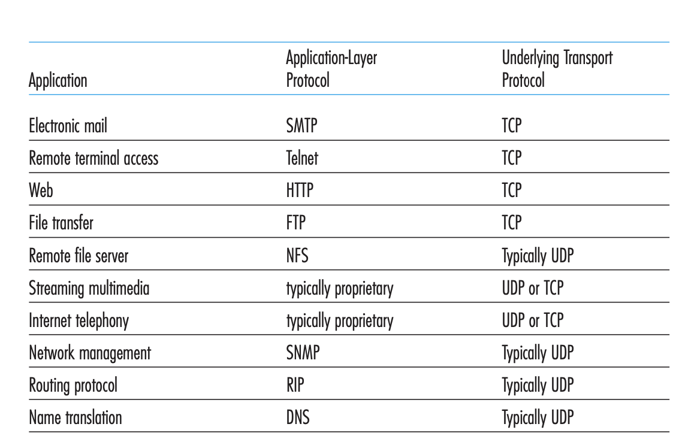

### :small_blue_diamond: 3.3.1 UDP Segment Structure

DNS -the data field contains either a query message or a response message. For a streaming audio app, audio samples fill the data field. 

The length field specifies the n.o. bytes in the UDP segment (header plus data). An explicit length value is needed since the size of the data field may differ from one UDP segment to the next. 

The checksum is used by the receiving host to check whether errors have been introduced into the segment. The checksum is also calculated over a few of the fields in the IP header in addition to the UDP segment.

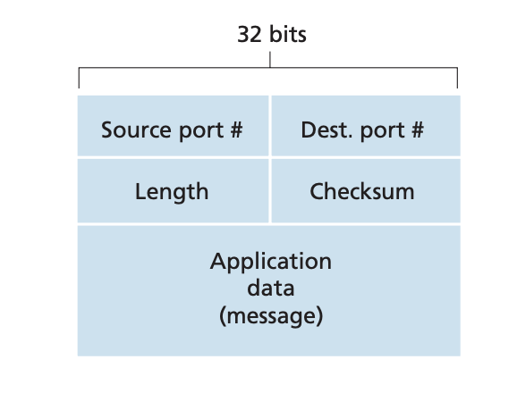

### :small_blue_diamond: 3.3.2 UDP Checksum

The UDP checksum provides for error detection. \
The checksum is used to determine whether bits within the UDP segment have been altered (by noise in the links or while stored in a router) as it moved from source to dest. 

UDP at the sender side performs the **1s complement of the sum** of all the 16-bit words in the segment, with any overflow encountered during the sum being wrapped around. This result is put in the checksum field of the UDP segment.

Three 16-bit words:
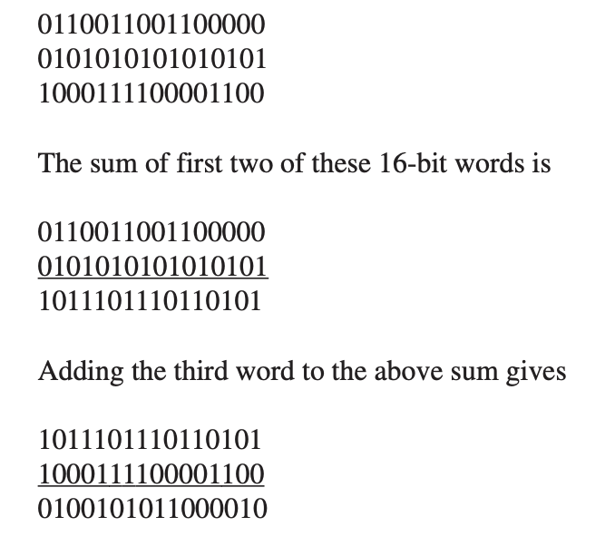

Last addition had overflow, which was wrapped around. \
The 1s complement is obtained by converting all the 0s to 1s and converting all the 1s to 0s. Thus the 1s complement of the sum 0100101011000010 is 1011010100111101, which becomes the checksum. At the receiver, all four 16-bit words are added, including the checksum. If no errors are introduced into the packet, then clearly the sum at the receiver will be 1111111111111111. If one of the bits is a 0, then we know that errors have been introduced into the packet.

Why UDP provides a checksum, as many link-layer protocols (inc Ethernet) also provide error checking:

- no guarantee that all the links between source and dest provide error checking; that is, one of the links may use a link-layer protocol that does not provide error checking. 
- even if segments are correctly transferred across a link, it’s possible that bit errors could be introduced when a segment is stored in a router’s memory. 

Given that neither link-by-link reliability nor in-memory error detection is guaranteed, UDP must provide error detection at the transport layer, on an end-end basis, if the end-end data transfer service is to provide error detection -> **end-end principle** in system design, which states that since certain functionality (error detection, in this case) must be implemented on an end-end basis: “functions placed at the lower levels may be redundant or of little value when compared to the cost of providing them at the higher level.”

Because IP is supposed to run over just about any layer-2 protocol, it is useful for the transport layer to provide error checking as a safety measure.

UDP does not do anything to recover from an error: discard the damaged segment or pass the damaged segment to the appl with a warning.

## :green_circle: 3.4 Principles of Reliable Data Transfer

For example, TCP is a reliable data transfer protocol that is implemented on top of an unreliable (IP) end-to-end net layer. 

### :small_blue_diamond: 3.4.1 Building a Reliable Data Transfer Protocol
### :small_blue_diamond: 3.4.2 Pipelined Reliable Data Transfer Protocols
### :small_blue_diamond: 3.4.3 Go-Back-N (GBN)
### :small_blue_diamond: 3.4.4 Selective Repeat (SR)

## :green_circle: 3.5 Connection-Oriented Transport: TCP

### :small_blue_diamond: 3.5.1 The TCP Connection

TCP **connection-oriented** - before one app process can begin to send data to another, the two processes must first “handshake” with each other—that is, they must send some preliminary segments to each other to establish the parameters of the ensuing data transfer. 

TCP connection provides a **full-duplex service** - if there is a TCP conn b/ Process A on one host and Process B on another host, then app-layer data can flow from Process A to Process B at the same time as app-layer data flows from Process B to Process A. TCP conn is also always **point-to-point** - b/ a single sender and a single receiver. So-called “multicasting” —the transfer of data from one sender to many receivers in a single send operation—is not possible with TCP. 

Process that is initiating the conn is called the **client process**, while the other process is called the **server process**. The client app process first informs the client transport layer that it wants to establish a connection to a process in the server. 

Python client program does this by issuing the command:

`clientSocket.connect((serverName,serverPort))`

- client first sends a special TCP segment
- server responds with a second special TCP segment
- client responds with a third special segment
- once a TCP connection is established, the two appprocesses can send data to each other

The first two segments carry no payload [no app-layer data],
the third of these segments may carry a payload. \
Because three segments are sent between the two hosts, this connection-establishment procedure is often referred to as a **three-way handshake**.

- TCP directs data to the conn’s **send buffer**, which is one of the buffers that is set aside during the initial three-way handshake. From time to time, TCP grabs chunks of data from the send buffer and pass the data to the net layer
- The max amount of data that can be grabbed and placed in a segment is limited by the **maximum segment size (MSS)** [max amount of app-layer data]. The MSS is typically set by first determining the length of the largest link-layer frame that can be sent by the local sending host (the so-called **max transmission unit, MTU**), and then setting the MSS to ensure that a TCP segment (when encapsulated in an IP datagram) plus the TCP/IP header length (~ 40 bytes) will fit into a single link-layer frame. Both Ethernet and PPP link-layer protocols have an MSS of 1,500 bytes.

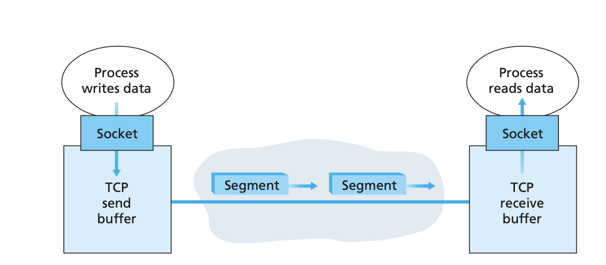

TCP pairs data + TCP header = TCP segments. The segments are passed down to the net layer, encapsulated within net-layer IP datagrams.\
The IP datagrams are then sent into the network. When TCP receives a segment at the other end, the segment’s data is placed in the TCP connection’s **receive buffer**. The app reads the stream of data from this buffer. 

### :small_blue_diamond: 3.5.2 TCP Segment Structure

When TCP sends a large file (e.g image as part of a Web page) it typically breaks the file into chunks of size MSS.

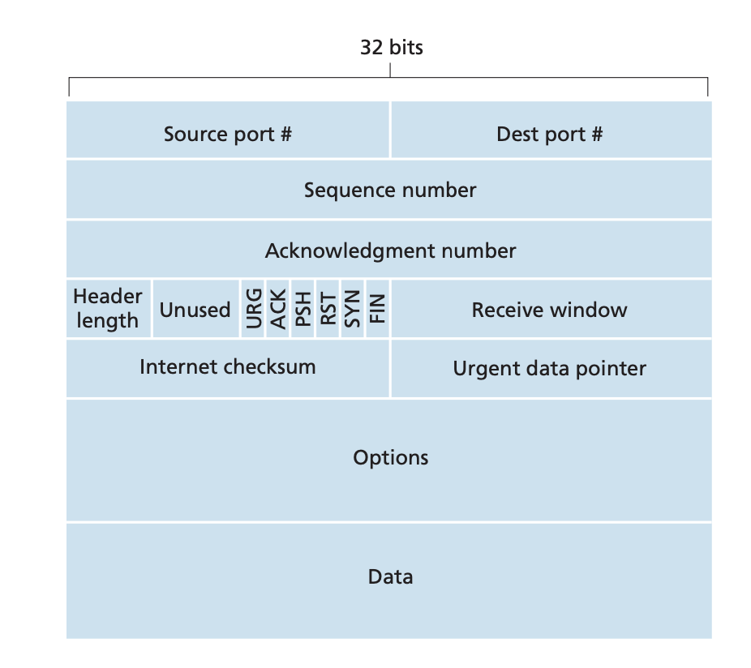

- The 32-bit **sequence number** field and the 32-bit **acknowledgment number** field are used by the TCP sender and receiver in implementing a reliable data transfer service.

- The 16-bit **receive window** field is used for flow control. It is used to indicate the n.o. bytes that a receiver is willing to accept.

- The 4-bit **header length** field specifies the length of the TCP header in 32-bit words. The TCP header can be of variable length due to the TCP options field. (Typically, the options field is empty, so that the length of the typical TCP header is 20 bytes.)

- The **optional** and variable-length options field is used when a sender and receiver negotiate the maximum segment size (MSS) or as a window scaling factor for use in high-speed networks. A time-stamping option is also defined. 

- The flag field contains 6 bits. The **ACK** bit is used to indicate that the value carried in the acknowledgment field is valid; that is, the segment contains an acknowledgment for a segment that has been successfully received. The **RST, SYN, and FIN** bits are used for connection setup and teardown. Setting the **PSH** bit indicates that the receiver should pass the data to the upper layer immediately. Finally, the **URG** bit is used to indicate that there is data in this segment that the sending-side upper-layer entity has marked as “urgent.” The location of the last byte of this urgent data is indicated by the 16-bit **urgent data pointer** field. TCP must inform the receiving-side upper-layer entity when urgent data exists and pass it a pointer to the end of the urgent data. (In practice, the PSH, URG, and the urgent data pointer are not used. However, we mention these fields for completeness.)

**Sequence Numbers and Acknowledgment Numbers**

The sequence number for a segment is the byte-stream number of the first byte in the segment.

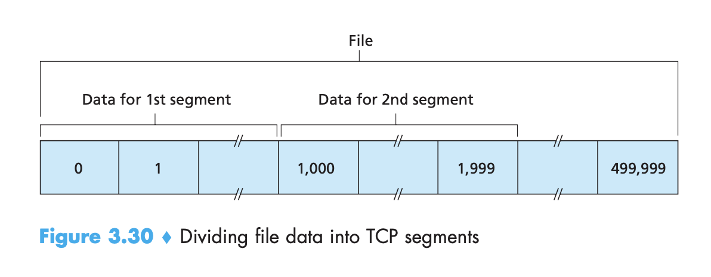

TCP is full-duplex: Host A may be receiving data from Host B while it sends data to Host B (as part of the same TCP connection). Each of the segments that arrive from Host B has a sequence number for the data flowing from B to A. \
**The acknowledgment number that Host A puts in its segment is the sequence number of the next byte Host A is expecting from Host B**. \
Suppose that Host A has received all bytes numbered 0 through 535 from B and suppose that it is about to send a segment to Host B. Host A is waiting for byte 536 and all the subsequent bytes in Host B’s data stream. So Host A puts 536 in the acknowledgment number field of the segment it sends to B.

Another example: 
- Host A has received one segment from Host B containing bytes 0 through 535 and another segment containing bytes 900 through 1,000. 
- Host A has not yet received bytes 536 through 899. Host A is still waiting for byte 536 (and beyond) in order to re-create B’s data stream. 
- A’s next segment to B will contain 536 in the acknowledgment number field. Because TCP only acknowledges bytes up to the first missing byte in the stream, TCP is said to provide **cumulative acknowledgments**.
- Host A received the third segment (bytes 900 through 1,000) before receiving the second segment (bytes 536 through 899). Thus, the third segment arrived out of order. 

There are basically two choices: either (1) the receiver immediately discards out-of-order segments (which can simplify receiver design), or (2) the receiver keeps the out-of-order bytes and waits for the missing bytes to fill in the gaps. Clearly, the latter choice is more efficient in terms of network bandwidth, and is the approach taken in practice.

In Figure 3.30, we assumed that the initial sequence number was zero. In truth, both sides of a TCP connection randomly choose an initial sequence number. This is done to minimize the possibility that a segment that is still present in the network from an earlier, already-terminated connection between two hosts is mistaken for a valid segment in a later connection between these same two hosts (which also happen to be using the same port numbers as the old connection). 

**Telnet: A Case Study for Sequence and Acknowledgment Numbers**

**Telnet** is a popular app-layer protocol used for remote login. It runs over TCP and is designed to work between any pair of hosts. Telnet is an interactive application. Many users now prefer to use the SSH protocol rather than Telnet, since data sent in a Telnet conn (including passwords!) is not encrypted, making Telnet vulnerable to eavesdropping attacks.

- Host A (client) initiates a Telnet session with Host B (server).  
- Each character typed by the user (at the client) will be sent to the remote host.
- Remote host will send back a copy of each character, which will be displayed on the Telnet user’s screen. This “echo back” is used to ensure that characters seen by the Telnet user have already been received and processed at the remote site. Each character thus traverses the network twice between the time the user hits the key and the time the character is displayed on the user’s monitor.

The first segment sent from the client will have sequence number 42; the first segment sent from the server will have sequence number 79. Acknowledgment number is the sequence number of the next byte of data that the host is waiting for. After the TCP connection is established but before any data is sent, the client is waiting for byte 79 and the server is waiting for byte 42.

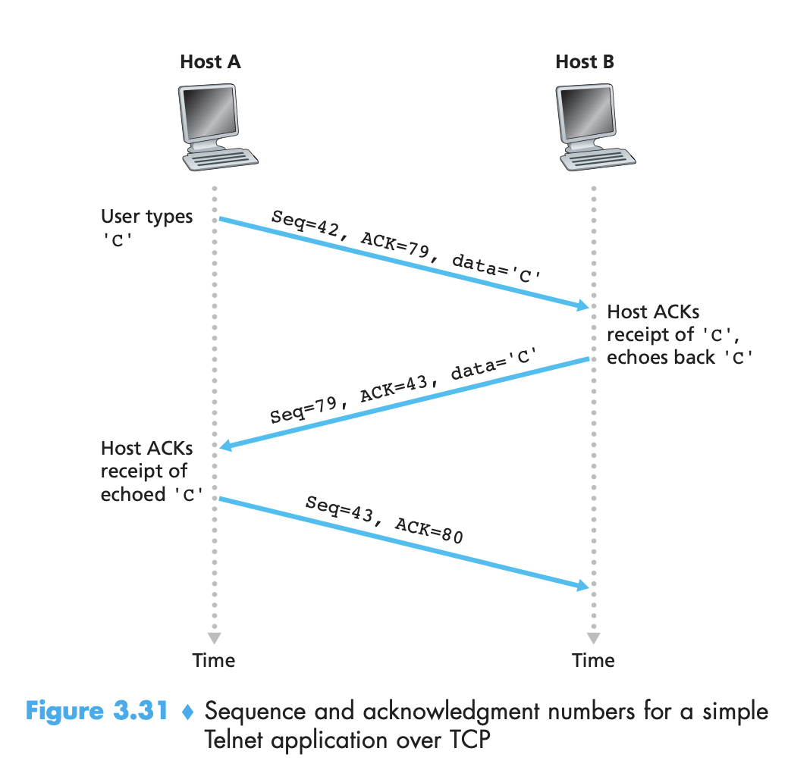

Note that the acknowledgment for client-to-server data [ACK=79] is carried in a segment carrying server-to-client data [Seq=79]; this acknowledgment is said to be **piggybacked** on the server-to-client data segment.

The third segment - sole purpose is to acknowledge the data it has received from the server (char `C`). This segment has an empty data field (that is, the acknowledgment is not being piggybacked with any client-to-server data). The segment has 80 in the acknowledgment number field because the client has received the stream of bytes up through byte sequence number 79 and it is now waiting for bytes 80 onward. This segment also has a sequence number but the segment contains no data - as the segment needs to have some sequence number.

### :small_blue_diamond: 3.5.3 Round-Trip Time Estimation and Timeout

TCP uses a timeout/retransmit mechanism to recover from lost segments. Timeout should be larger than the connection’s round-trip time (RTT).

**Estimating the Round-Trip Time**

The sample RTT, denoted SampleRTT, for a segment is the amount of time between when the segment is sent (that is, passed to IP) and when an acknowledgment for the segment is received. Instead of measuring a SampleRTT for every transmitted segment, most TCP implementations take only one SampleRTT measurement at a time. That is, at any point in time, the SampleRTT is being estimated for only one of the transmitted but currently unacknowledged segments, leading to a new value of SampleRTT approximately once every RTT. Also, TCP never computes a SampleRTT for a segment that has been retransmitted; it only measures SampleRTT for segments that have been transmitted once.

SampleRTT values will fluctuate from segment to segment due to congestion in the routers and to the varying load on the end systems -> an average, called EstimatedRTT, of the SampleRTT values [exponential weighted moving average]. 

**Setting and Managing the Retransmission Timeout Interval**

TimeoutInterval = EstimatedRTT + 4 • DevRTT

An initial TimeoutInterval value of 1 second is recommended. Also, when a timeout occurs, the value of TimeoutInterval is doubled to avoid a premature timeout occurring for a subsequent segment that will soon be acknowledged. However, as soon as a segment is received and EstimatedRTT is updated, the TimeoutInterval is again computed using the formula above.

### :small_blue_diamond: 3.5.4 Reliable Data Transfer

Internet’s network-layer service (IP service) is unreliable:

-  IP does not guarantee datagram delivery (datagrams can overflow router buffers and never reach their destination)

- does not guarantee in-order delivery of datagrams (datagrams can arrive out of order)

- does not guarantee the integrity of the data in the datagrams (bits in the datagram can get corrupted (flipped from 0 to 1 and vice versa) )

TCP creates a reliable data transfer service on top of IP’s unreliable best-effort service. TCP’s reliable data transfer service ensures that the data stream that a process reads out of its TCP receive buffer is uncorrupted, without gaps, without duplication, and in sequence; that is, the byte stream is exactly the same byte stream that was sent by the end system on the other side of the connection. 

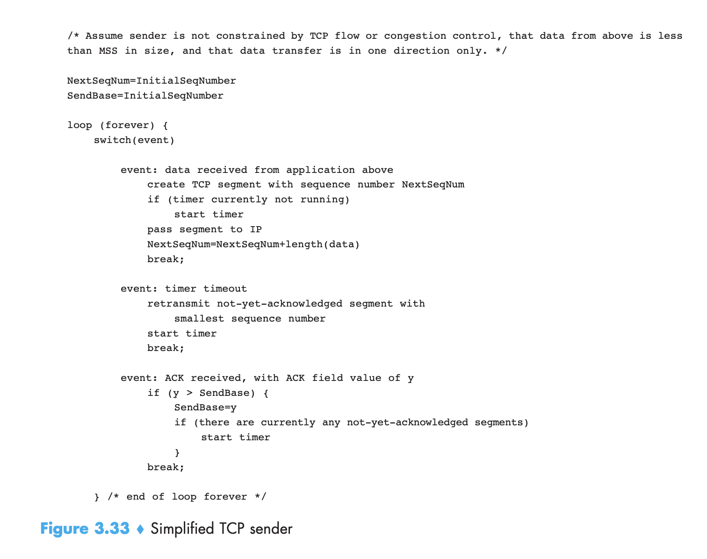

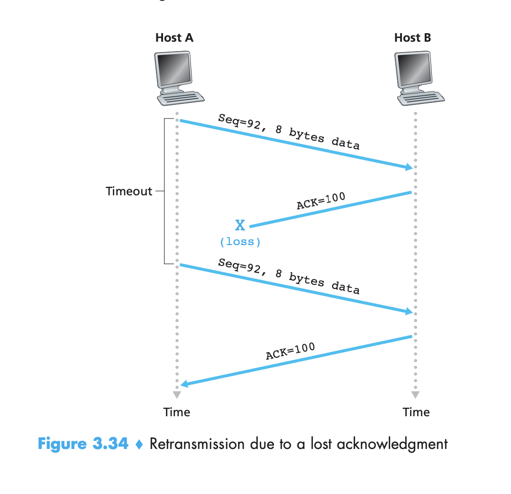

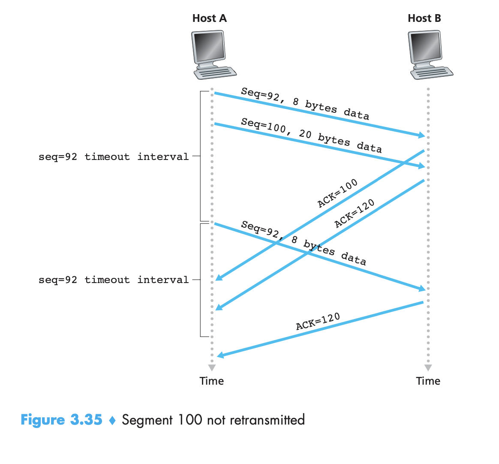

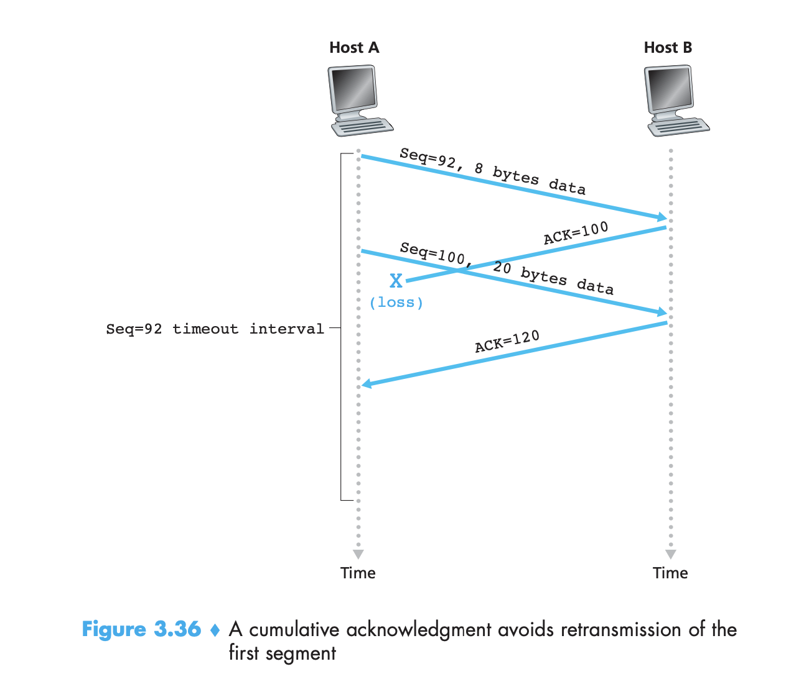

**Doubling the Timeout Interval**

Whenever the timeout event occurs, TCP retransmits the not-yet-acknowledged segment with the smallest sequence number. But each time TCP retransmits, it sets the next timeout interval to twice the previous value, rather than deriving it from the last EstimatedRTT and DevRTT. \
Thus the intervals grow exponentially after each retransmission. However, whenever the timer is started after either of the two other events (that is, data received from application above, and ACK received), the TimeoutInterval is derived from the most recent values of EstimatedRTT and DevRTT.

This modification provides a limited form of congestion control. The timer expiration is most likely caused by congestion in the network, that is, too many packets arriving at one (or more) router queues in the path between the source and destination, causing packets to be dropped and/or long queuing delays. In times of congestion, if the sources continue to retransmit packets persistently, the congestion may get worse. Instead, TCP acts more politely, with each sender retransmitting after longer and longer intervals. 

**Fast Retransmit**

One of the problems with timeout-triggered retransmissions is that the timeout period can be relatively long. When a segment is lost, this long timeout period forces the sender to delay resending the lost packet, thereby increasing the end-to- end delay. 

Sender can often detect packet loss well before the timeout event occurs by noting so-called duplicate ACKs. A duplicate ACK is an ACK that reacknowledges a segment for which the sender has already received an earlier acknowledgment. To understand the sender’s response to a duplicate ACK, we must look at why the receiver sends a duplicate ACK in the first place: Table 3.2 summarizes the TCP receiver’s ACK generation policy [RFC 5681]. When a TCP receiver receives a segment with a sequence number that is larger than the next, expected, in-order sequence number, it detects a gap in the data stream—that is, a missing seg- ment. This gap could be the result of lost or reordered segments within the network.

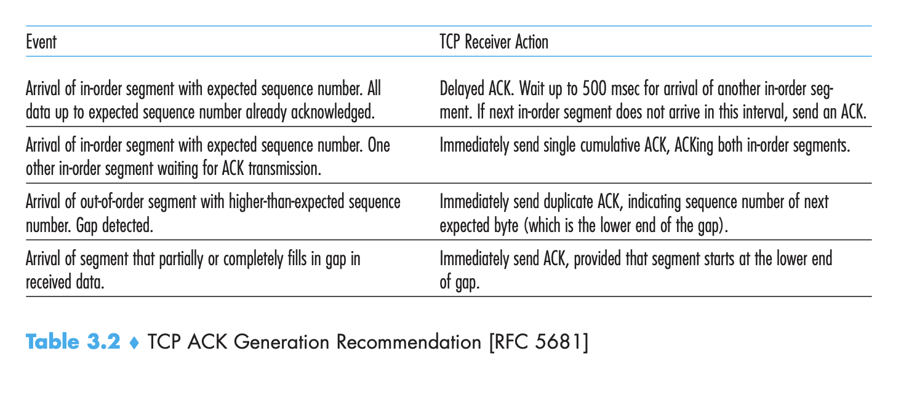

TCP reacknowledges (that is, generates a duplicate ACK for) the last in-order byte of data it has received. (Note that Table 3.2 allows for the case that the receiver does not discard out-of-order segments.)

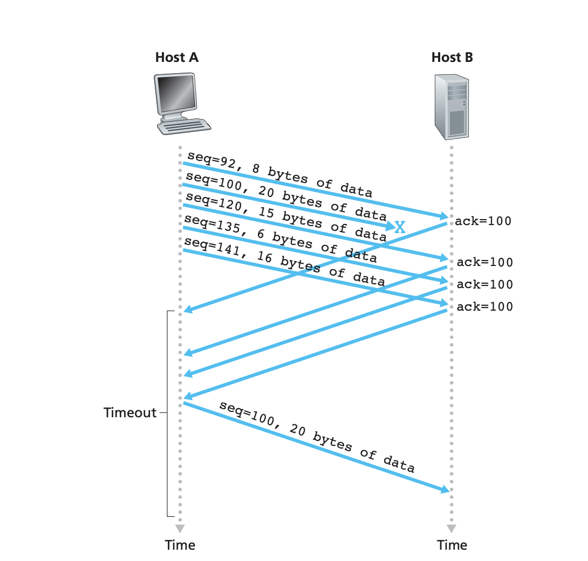

Because a sender often sends a large number of segments back to back, if one seg- ment is lost, there will likely be many back-to-back duplicate ACKs. If the TCP sender receives three duplicate ACKs for the same data, it takes this as an indication that the segment following the segment that has been ACKed three times has been lost. In the case that three duplicate ACKs are received, the TCP sender performs a fast retransmit [RFC 5681], retransmitting the missing segment before that segment’s timer expires. This is shown in Figure 3.37, where the second segment is lost, then retransmitted before its timer expires. 

### :small_blue_diamond: 3.5.5 Flow Control

Hosts on each side of a TCP connection set aside a **receive buffer** for the connection. \
When the TCP connection receives bytes that are correct and in sequence, it places the data in the receive buffer. The associated application process will read data from this buffer, but not necessarily at the instant the data arrives. Indeed, the receiving application may be busy with some other task and may not even attempt to read the data until long after it has arrived. If the application is rela- tively slow at reading the data, the sender can very easily overflow the connection’s receive buffer by sending too much data too quickly.

### :small_blue_diamond: 3.5.6 TCP Connection Management

## :green_circle: 3.6 Principles of Congestion Control

### :small_blue_diamond:
### :small_blue_diamond:
### :small_blue_diamond:

## :green_circle 3.7 TCP Congestion Control

### :small_blue_diamond:

